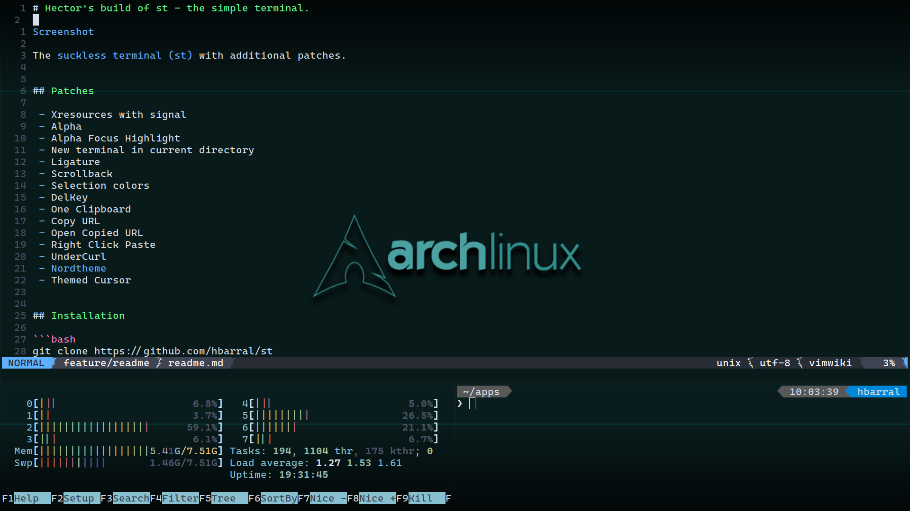

# Hector's build of st - the simple terminal.



The [suckless terminal (st)](https://st.suckless.org/) with additional patches.


## Patches

 - Font2
 - Alpha Focus Highlight
 - Ligature
 - New terminal in current directory
 - Xresources
 - [Nordtheme](https://www.nordtheme.com)
 - Scrollback
 - Selection colors


## Bindings

 - **scrollback** with `shift-pageup/down` or scrolling the mouse.


## Installation

```bash
git clone https://github.com/hbarral/st
cd st
sudo make install
```


## Credits

- Based on Aurélien APTEL <aurelien dot aptel at gmail dot com> bt source code.
- Wallpaper by [muser](https://forum.manjaro.org/u/muser)
