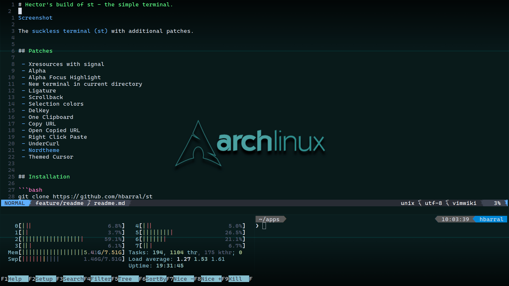

# Hector's build of st - the simple terminal.



The [suckless terminal (st)](https://st.suckless.org/) with additional patches.


## Patches

 - Xresources with signal
 - Alpha
 - Alpha Focus Highlight
 - New terminal in current directory
 - Ligature
 - Scrollback
 - Selection colors
 - DelKey
 - One Clipboard
 - Copy URL
 - Open Copied URL
 - Right Click Paste
 - UnderCurl
 - [Nordtheme](https://www.nordtheme.com)
 - Themed Cursor


## Installation

```bash
git clone https://github.com/hbarral/st
cd st
make && sudo make install && make clean
```


## Bindings

- `Shift+PageUp` to scroll backwards.
- `Shift+PageDown` to scroll forward.
- `Alt+l` to cycle through the available URLs.
- `Alt+o` to open a URL with the default browser.
- `Ctrl+Shift+PageUp` to increase the font size.
- `Ctrl+Shift+PageDown` to increase the font size.
- `Shift+Home` to reset the font size.
- `Ctrl+Shift+Enter` to open another terminal in the current directory.
- `Ctrl+Shift+c` copy to clipboard.
- `Ctrl+Shift+v` to paste from the clipboard.
- `Right Click` to paste from the clipboard.


## Configuration
- Some configurations that can be added to `.Xresources`

```ini
st.font: Cascadia Code-16;
st.cursorstyle: 2
st.alpha: 0.2
st.alphaUnfocussed: 0.1
st.background: black
```


## Credits

- Based on Aurélien APTEL <aurelien dot aptel at gmail dot com> bt source code.
- https://wallpaperaccess.com/download/arch-linux-1776183
